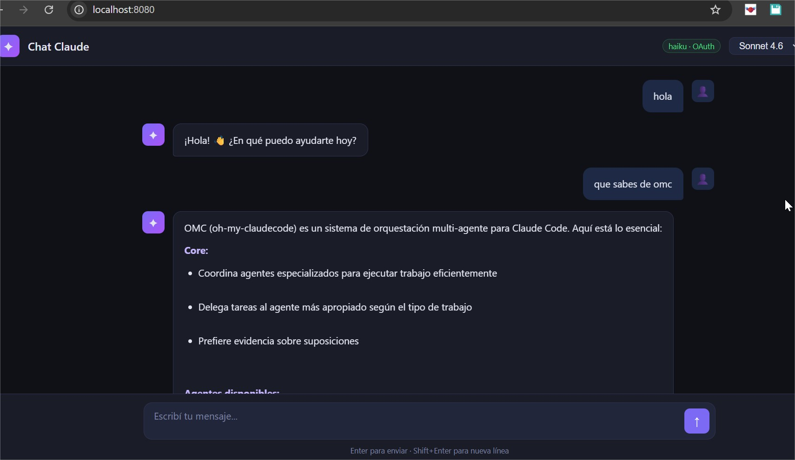
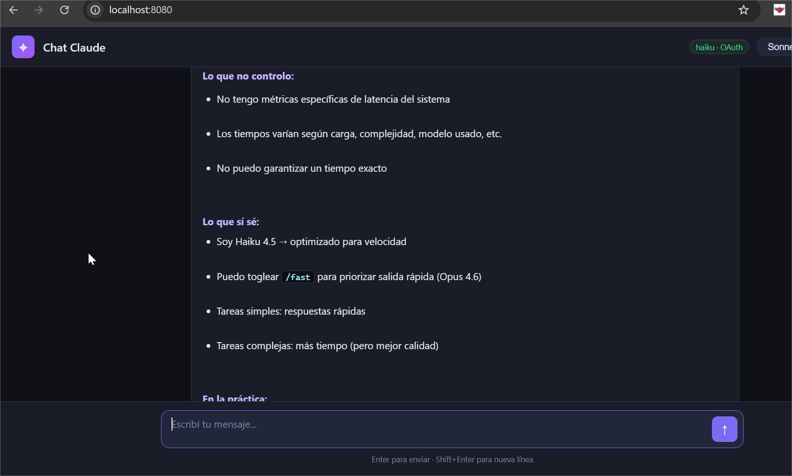

# Chat Claude — OAuth Local

Chat web que reutiliza las **credenciales OAuth de Claude Code** sin necesidad de API key. Consume tu plan Pro/Max existente directamente desde el CLI.

> **Uso personal y local.** Lee la sección de seguridad antes de exponer a la red.

---

## Capturas


*Conversación activa — respuestas con formato markdown, selector de modelo y badge de estado OAuth*


*Renderizado de listas, código inline y texto enriquecido en tiempo real*

---

## Tabla de contenido

- [Cómo funciona](#cómo-funciona)
- [Estructura del proyecto](#estructura-del-proyecto)
- [Requisitos](#requisitos)
- [Instalación y modos de uso](#instalación-y-modos-de-uso)
- [Frontends disponibles](#frontends-disponibles)
- [Variables de entorno](#variables-de-entorno)
- [Modelos disponibles](#modelos-disponibles)
- [Seguridad — Leer antes de usar](#seguridad--leer-antes-de-usar)
- [Advertencias al subir a GitHub](#advertencias-al-subir-a-github)

---

## Cómo funciona

```
Navegador / Flutter
      │  HTTP + SSE
      ▼
backend/server.js  (Express en :3200)
      │  stdin/stdout JSON streaming
      ▼
claude CLI  (claude --dangerously-skip-permissions)
      │  OAuth token
      ▼
API de Anthropic
```

El backend mantiene una **sesión persistente** del Claude CLI. Al iniciar envía un mensaje "ping" silencioso para que el proceso cargue sus hooks y quede listo. Las consultas reales llegan con el proceso ya caliente (~4s de latencia vs ~14s por-request).

Las credenciales OAuth viven en `~/.claude/.credentials.json` en tu máquina. Nunca se envían al repositorio.

---

## Estructura del proyecto

```
chat_claude042026/
├── backend/
│   ├── server.js          ← API Express (SSE streaming, sesión persistente)
│   ├── package.json
│   └── Dockerfile
├── frontend/
│   ├── web/               ← SPA — HTML/JS vanilla, PWA-ready
│   │   ├── index.html
│   │   ├── config.js      ← Editar URL del backend aquí
│   │   ├── manifest.json
│   │   └── sw.js          ← Service Worker para PWA
│   ├── mobile/            ← Capacitor (genera APK)
│   │   ├── capacitor.config.json
│   │   └── README_MOBILE.md
│   └── flutter/           ← App Flutter (web + Android + iOS)
│       ├── lib/
│       │   ├── main.dart
│       │   ├── chat_screen.dart
│       │   ├── api_service.dart
│       │   └── config.dart
│       └── pubspec.yaml
├── docker-compose.yml     ← Solo backend (frontend servido por separado)
├── ARQUITECTURA.md
├── FLUJO_DATOS.md
└── IDEAS_DEPLOY.md
```

---

## Requisitos

- **Node.js** 18+
- **Claude Code CLI** instalado y autenticado:
  ```bash
  claude auth login
  ```
  Verifica que existe `~/.claude/.credentials.json`

Para Docker:
- **Docker Desktop** 4.x+

Para Flutter:
- **Flutter SDK** 3.x+ con `flutter doctor` sin errores críticos

---

## Instalación y modos de uso

### Modo 1 — Directo con Node (más simple)

```bash
cd backend
npm install
node server.js
```

Abrí `frontend/web/index.html` en el navegador. El `config.js` ya apunta a `http://localhost:3200` por defecto.

### Modo 2 — Docker

```bash
docker-compose up --build
```

El backend queda disponible en `http://localhost:3200`.

Servir el frontend web por separado (cualquier servidor estático):

```bash
# con npx
npx serve frontend/web -l 8080

# con Python
python -m http.server 8080 --directory frontend/web
```

### Modo 3 — Flutter web

```bash
cd frontend/flutter
flutter pub get
flutter run -d chrome --dart-define=API_URL=http://localhost:3200
```

O compilar para producción:

```bash
flutter build web --dart-define=API_URL=http://localhost:3200
# output en: frontend/flutter/build/web/
```

### Modo 4 — PWA (instalar en móvil desde Chrome)

1. Servir el frontend: `npx serve frontend/web -l 8080`
2. Abrí `http://TU_IP:8080` en Chrome mobile
3. Menú → "Agregar a pantalla de inicio"
4. Se instala como app nativa sin necesidad de Store

### Modo 5 — APK con Capacitor

Ver `frontend/mobile/README_MOBILE.md` para instrucciones completas.

---

## Frontends disponibles

| Frontend | Descripción | Cómo correr |
|----------|-------------|-------------|
| `frontend/web/` | SPA HTML/JS, dark theme, PWA | Abrir `index.html` o servir con nginx |
| `frontend/flutter/` | App Flutter (web/Android/iOS) | `flutter run -d chrome` |
| `frontend/mobile/` | Wrapper Capacitor para APK | Ver `README_MOBILE.md` |

Todos consumen el mismo backend en `localhost:3200`. Para cambiar la URL editá:

- **Web:** `frontend/web/config.js`
  ```js
  window.CLAUDE_API_URL = 'http://192.168.1.100:3200';
  ```
- **Flutter:** `frontend/flutter/lib/config.dart` o pasar `--dart-define=API_URL=...` al compilar

---

## Variables de entorno

| Variable | Default | Descripción |
|----------|---------|-------------|
| `PORT` | `3200` | Puerto del servidor Express |
| `ALLOWED_ORIGINS` | `*` | Orígenes CORS permitidos (ver sección seguridad) |
| `NODE_ENV` | `development` | Modo de ejecución |

---

## Modelos disponibles

| ID | Descripción |
|----|-------------|
| `claude-haiku-4-5-20251001` | Rápido y liviano |
| `claude-sonnet-4-6` | Equilibrio velocidad/capacidad |
| `claude-opus-4-6` | Máxima capacidad |

El modelo se puede cambiar desde la interfaz sin reiniciar el servidor.

---

## Seguridad — Leer antes de usar

Este proyecto fue diseñado para **uso personal en red local**. Tiene decisiones de diseño que priorizan la simplicidad sobre la seguridad. Entendé los riesgos antes de usarlo.

---

### Riesgo 1 — `--dangerously-skip-permissions` (CRÍTICO)

El CLI corre con el flag `--dangerously-skip-permissions`, lo que significa que Claude puede ejecutar herramientas del sistema (leer archivos, escribir, ejecutar comandos) **sin pedir confirmación**.

**Consecuencia:** Cualquier persona que pueda enviar un mensaje al endpoint `/api/chat` puede potencialmente instruir a Claude para que lea o modifique archivos en el servidor.

**Mitigación mínima recomendada:** Agregar autenticación al backend si lo vas a exponer fuera de `localhost`:

```js
// En backend/server.js — agregar antes de las rutas /api
const API_TOKEN = process.env.API_TOKEN;
if (API_TOKEN) {
  app.use('/api', (req, res, next) => {
    if (req.headers.authorization !== `Bearer ${API_TOKEN}`) {
      return res.status(401).json({ error: 'Unauthorized' });
    }
    next();
  });
}
```

```bash
# En .env (no commitear)
API_TOKEN=tu_token_secreto_largo
```

---

### Riesgo 2 — Volumen Docker expone `~/.claude/` (CRÍTICO)

El `docker-compose.yml` monta el directorio completo `~/.claude/` dentro del contenedor:

```yaml
volumes:
  - ${USERPROFILE}/.claude:/root/.claude:ro
```

Esto es necesario para que el CLI encuentre sus credenciales, pero significa que el proceso dentro del contenedor puede leer `~/.claude/.credentials.json` (tokens OAuth), `~/.claude/settings.json` y cualquier otro archivo del directorio.

**Combinado con el Riesgo 1:** Si el endpoint está abierto sin autenticación, un atacante podría instruir a Claude para que lea y devuelva el contenido de `.credentials.json`.

**Mitigación:** Si querés reducir la superficie, montá solo el archivo de credenciales:

```yaml
volumes:
  - ${USERPROFILE}/.claude/.credentials.json:/root/.claude/.credentials.json:ro
```

Aunque la mitigación real es agregar autenticación (Riesgo 1).

---

### Riesgo 3 — CORS abierto a `*`

El servidor responde a requests de **cualquier origen** por defecto (`ALLOWED_ORIGINS=*`).

**Consecuencia:** Una página web maliciosa abierta en tu navegador puede hacer llamadas silenciosas a `localhost:3200` y usar tu sesión de Claude.

**Mitigación:** Restringir los orígenes al valor exacto que uses:

```yaml
# docker-compose.yml
environment:
  - ALLOWED_ORIGINS=http://localhost:8080,http://localhost:3200
```

```bash
# Sin Docker
ALLOWED_ORIGINS=http://localhost:8080 node server.js
```

---

### Riesgo 4 — Sin autenticación en los endpoints

Los tres endpoints (`/api/chat`, `/api/reset`, `/api/status`) no requieren ninguna credencial.

**Consecuencia adicional:** El endpoint `/api/reset` acepta un parámetro `model` que determina qué modelo usa el CLI. Sin validación, alguien podría forzar el uso de modelos más costosos (Opus) para consumir tu cuota.

**Mitigación adicional:** Validar el modelo contra una lista permitida en `backend/server.js`.

---

### Riesgo 5 — XSS en mensajes de error (MEDIO)

Los mensajes de error del servidor se insertan con `innerHTML` sin escapar en la versión web vanilla (`frontend/web/index.html`). Esto puede ser explotado si el backend devuelve contenido malicioso en el campo `error`.

**Mitigación:** Usar `textContent` en lugar de `innerHTML` para mensajes de error, o escapar el contenido antes de insertarlo.

---

### Resumen de mitigaciones

| Riesgo | Impacto | Mitigación |
|--------|---------|------------|
| `--dangerously-skip-permissions` | Crítico | Agregar token de autenticación al backend |
| Volumen Docker `~/.claude/` | Crítico | Montar solo `.credentials.json`, agregar auth |
| CORS `*` | Alto | Restringir a orígenes específicos en `ALLOWED_ORIGINS` |
| Sin autenticación | Alto | Bearer token + validar parámetro `model` |
| XSS en errores | Medio | Escapar con `textContent` o `escapeHtml()` |

---

## Advertencias al subir a GitHub

**El repositorio NO contiene credenciales.** Antes de hacer `git push` verificá:

```bash
# Buscar posibles secrets en el historial completo
git log -p | grep -i "sk-ant\|accessToken\|refreshToken\|password\|secret"

# Verificar que .credentials.json no está trackeado
git ls-files ~/.claude/

# El .gitignore ya cubre:
# .env, node_modules/, build/, *.credentials.json
```

Lo que **sí se publica** al subir el repo:

- El código fuente con la arquitectura de seguridad descrita arriba
- La configuración de Docker con el montaje de `~/.claude/`
- Las instrucciones de uso

Lo que **nunca se publica** porque vive solo en tu máquina:

- `~/.claude/.credentials.json` (tokens OAuth)
- `~/.claude/settings.json`
- Cualquier `.env` local

**Si publicás el repo como público:** Incluí un aviso claro de que es para uso personal/local y que exponer el puerto 3200 a internet sin autenticación representa un riesgo real.

---

## Licencia

MIT — Uso personal. Sin garantías de seguridad para entornos de producción.
